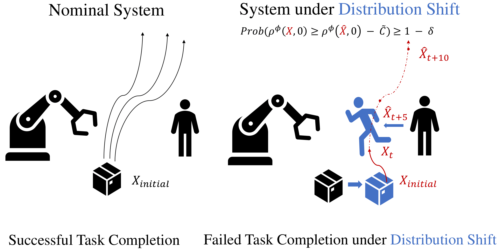

<small>Left: A robotic arm manipulating a box in the presence of a human. Right: The robotic
arm performing the same task when the human behavior and the package location changed. We
propose predictive robust runtime verification algorithms to verify systems under such distribution
shift.</small>

